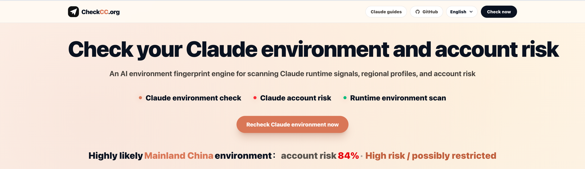
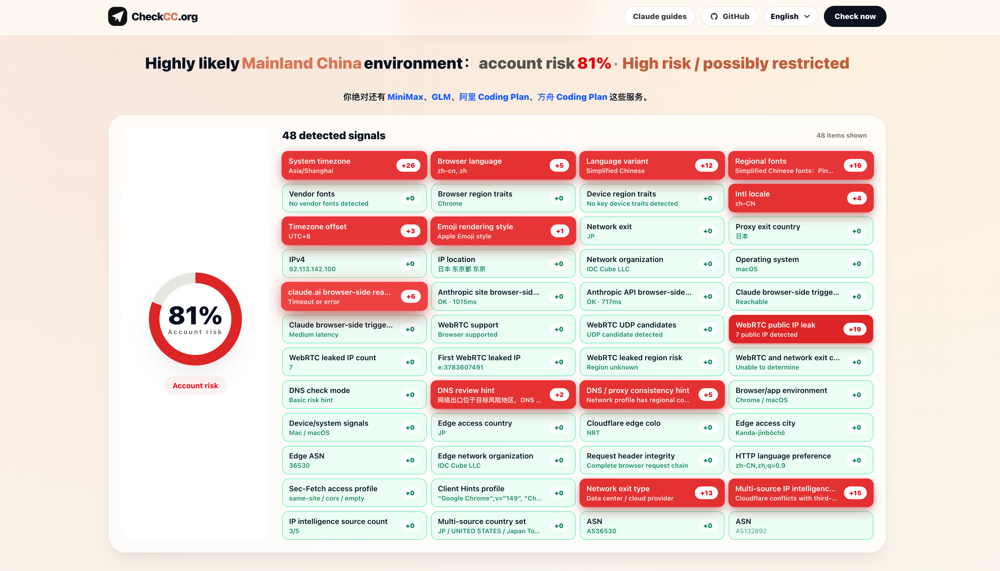
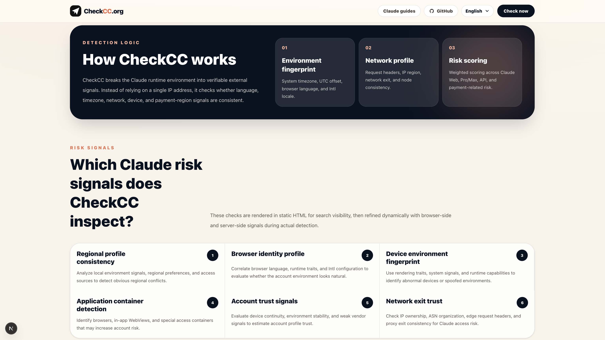
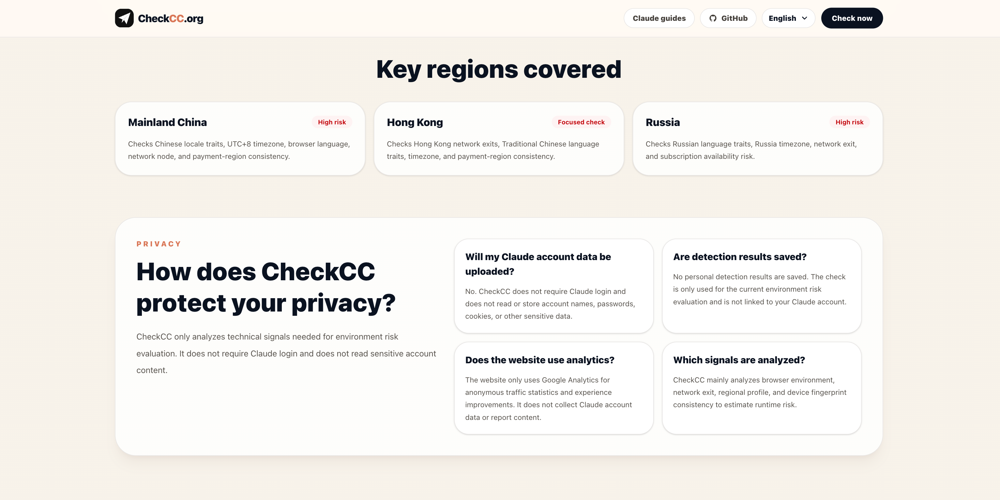

# CheckCC

[English](README.en.md) | [中文](README.md)

<p align="center">
  
</p>

[CheckCC.org](https://checkcc.org) is a Claude runtime environment checker and account-risk analysis tool for users who are creating a Claude account, subscribing to Claude Pro, applying for Claude API access, using Claude Code, or concerned about account restrictions, subscription failures, and high-risk environments.

The project analyzes browser fingerprint, system timezone, language preferences, Intl Locale, User-Agent, runtime container, device environment, network exit, and regional profile signals to identify environment conflicts. It helps users detect high-risk Claude environments, pre-restriction anomaly signals, account limitation risk, Claude Pro subscription risk, Claude API application risk, and Claude Code runtime risk before taking action.

- Official website: <https://checkcc.org>
- GitHub repository: <https://github.com/yacuo/check-cc>

## Resource Support

Development resources and AI token usage for this project are sponsored by 全球 AI Token 综合对比 <https://tokenplan.vip/> (tokenplan.vip).

## Screenshots

### Detection signals

<p align="center">
  
</p>

| Detection principles | Supported regions |
| --- | --- |
|  |  |

## Overview

[CheckCC](https://checkcc.org) is suitable for learning, secondary development, and self-hosting. The project focuses on environment risk hints before and after Claude usage. It does not read Claude account content and does not replace official Claude or Anthropic judgments.

**If you use this project for secondary development, redeployment, or derivative releases, please retain the original copyright, open-source license notice, and project source: <https://github.com/yacuo/check-cc.git>**

## How it works

Claude account risk is not determined by a single IP address or region. It is shaped by a multi-signal environment profile that includes browser fingerprint, system timezone, language preferences, network exit, runtime container, device environment, and payment context. [CheckCC](https://checkcc.org) includes 40+ environment detection dimensions and combines client-side environment sampling, server-side request analysis, IP intelligence, runtime feature recognition, and signal-consistency checks into a readable risk assessment for Claude account restriction risk, Claude Pro subscription risk, Claude API application risk, and Claude Code runtime risk.

Core detection dimensions include:

- **Browser language**: checks whether the preferred browser language matches the expected region.
- **System timezone**: checks whether the timezone is consistent with the regional profile.
- **Intl Locale**: checks whether JavaScript internationalization settings expose unusual language or region traits.
- **User-Agent**: identifies browser, operating system, and client container characteristics.
- **Runtime container**: detects WebView, automation-like environments, or non-standard clients.
- **Signal consistency**: evaluates whether language, timezone, region, and browser signals conflict with each other.

These signals cannot prove that an account is safe or will be restricted, but they can help users detect obvious environment profile conflicts early.

## Reducing ban risk

[CheckCC](https://checkcc.org) results are for reference only and do not represent official conclusions from Claude or Anthropic. Before using Claude, Claude Code, Claude Pro, or applying for Claude API access, you can check your environment first.

General suggestions:

- Keep IP, system timezone, browser language, and account region as consistent as possible.
- Avoid frequently switching countries, proxy nodes, devices, or browser environments.
- Avoid signing in through WebView, automated browsers, unusual clients, or unstable containers.
- Check the environment before subscribing to Claude Pro, applying for Claude API, or using Claude Code.
- If high-risk signals are detected, adjust the environment before signing in, subscribing, or applying for related services.
- Prefer stable long-term network exits and consistent device environments.

## Tech stack

- Next.js
- React
- TypeScript
- Tailwind CSS
- pnpm

## Features

- 40+ environment signals and risk hints
- Browser-side environment sampling and runtime feature recognition
- Pre-use environment checks for Claude Web, Pro, API, and Claude Code
- Multilingual page structure and responsive UI
- Suitable for learning, secondary development, and self-hosting

## Privacy

By default, the project only performs local browser environment checks:

- No Claude login required
- No Claude account access
- No password access
- No Cookie access
- No chat content access
- No default upload of detection results

## Quick start

```bash
pnpm install
pnpm dev
```

Open: <http://localhost:3000>

## Build

```bash
pnpm build
pnpm start
```

## Self-hosting

You can deploy this project to Vercel, Cloudflare Pages, Netlify, or your own server. You can also extend the detection rules, UI, and deployment workflow as needed.

## Use cases

- Learning browser environment detection
- Studying Claude runtime environment risk signals
- Building a personal environment checker
- Using it as a base for secondary development

## Disclaimer

[CheckCC](https://checkcc.org) provides risk hints based on local browser environment signals only. It does not represent official Claude or Anthropic judgments. Do not use the result as the only basis for account safety, subscription status, or appeal decisions.

## License

This project is open-sourced under the MIT License. Copyright © yacuo / CheckCC.

You may use, modify, and redistribute this project freely.

Any copy, secondary development version, self-hosted site, or substantial portion of the project must retain the original copyright and license notice, and credit the source: <https://github.com/yacuo/check-cc.git>

If you redeploy this project, please keep the footer credit or repository link so visitors can find the original project.
