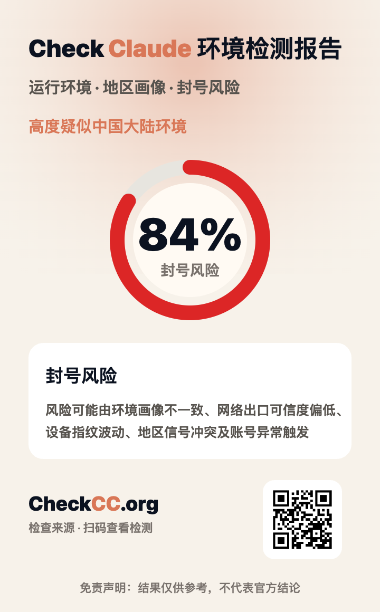

# CheckCC

[中文](README.md) | [English](README.en.md)

<p align="center">
  
</p>

[CheckCC](https://checkcc.org) is an open-source environment risk checker for Claude users. It analyzes browser language, system timezone, Intl Locale, User-Agent, runtime container, and other local technical signals to help identify environment profile conflicts that may affect Claude account stability.

- Official website: <https://checkcc.org>
- GitHub repository: <https://github.com/yacuo/check-cc>

## Screenshots

### Detection signals

<p align="center">
  
</p>

### Detection principles

<p align="center">
  
</p>

### Supported regions

<p align="center">
  
</p>

### Claude environment risk report

<p align="center">
  
</p>

## Overview

CheckCC is suitable for learning, secondary development, and self-hosting. The project focuses on whether the runtime environment is trustworthy, stable, and consistent. It does not read Claude account content and does not determine official account enforcement results.

## How it works

Claude account risk is usually not caused by a single factor. It is often related to a combined environment profile. CheckCC collects and analyzes common browser-side signals locally, then highlights possible conflicts.

Core detection dimensions include:

- **Browser language**: checks whether the preferred browser language matches the expected region.
- **System timezone**: checks whether the timezone is consistent with the regional profile.
- **Intl Locale**: checks whether JavaScript internationalization settings expose unusual language or region traits.
- **User-Agent**: identifies browser, operating system, and client container characteristics.
- **Runtime container**: detects WebView, automation-like environments, or non-standard clients.
- **Signal consistency**: evaluates whether language, timezone, region, and browser signals conflict with each other.

These signals cannot prove that an account is safe or will be restricted, but they can help users detect obvious environment profile conflicts early.

## Reducing ban risk

[CheckCC](https://checkcc.org) results are for reference only and do not represent official conclusions from Claude or Anthropic. Before using Claude, Claude Code, Claude Pro, or applying for Claude API access, you can check your environment first.

General suggestions:

- Keep IP, system timezone, browser language, and account region as consistent as possible.
- Avoid frequently switching countries, proxy nodes, devices, or browser environments.
- Avoid signing in through WebView, automated browsers, unusual clients, or unstable containers.
- Check the environment before subscribing to Claude Pro, applying for Claude API, or using Claude Code.
- If high-risk signals are detected, adjust the environment before signing in, subscribing, or applying for related services.
- Prefer stable long-term network exits and consistent device environments.

## Tech stack

- Next.js
- React
- TypeScript
- Tailwind CSS
- pnpm

## Features

- Browser language detection
- System timezone detection
- Intl Locale detection
- User-Agent detection
- Browser runtime container detection
- Basic risk scoring
- Local browser environment analysis
- Multilingual page structure
- Responsive UI

## Privacy

By default, the project only performs local browser environment checks:

- No Claude login required
- No Claude account access
- No password access
- No Cookie access
- No chat content access
- No default upload of detection results

## Quick start

```bash
pnpm install
pnpm dev
```

Open: <http://localhost:3000>

## Build

```bash
pnpm build
pnpm start
```

## Self-hosting

You can deploy this project to Vercel, Cloudflare Pages, Netlify, or your own server. You can also extend the detection rules, UI, and deployment workflow as needed.

## Use cases

- Learning browser environment detection
- Studying Claude runtime environment risk signals
- Building a personal environment checker
- Using it as a base for secondary development

## Disclaimer

[CheckCC](https://checkcc.org) provides risk hints based on local browser environment signals only. It does not represent official Claude or Anthropic judgments. Do not use the result as the only basis for account safety, subscription status, or appeal decisions.

## License

This project is open-sourced under the MIT License. Copyright © yacuo / CheckCC.

You may use, modify, and redistribute this project freely, but any copy or substantial portion must retain the original copyright and license notice and credit the source: <https://github.com/yacuo/check-cc.git>

If you redeploy this project, please keep the footer credit or repository link so visitors can find the original project.
