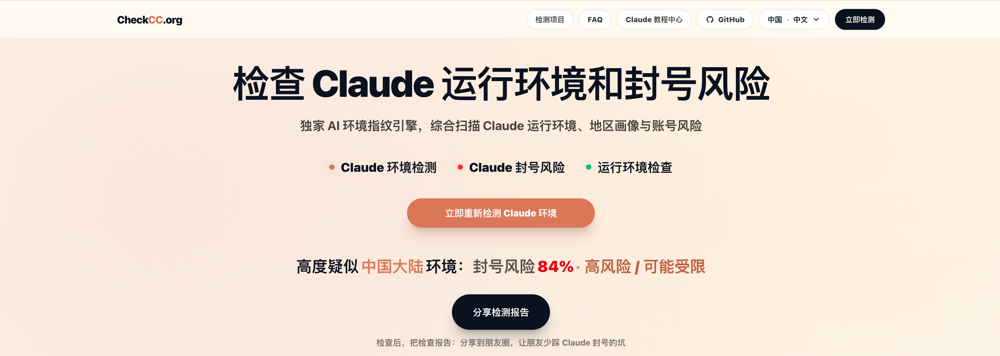
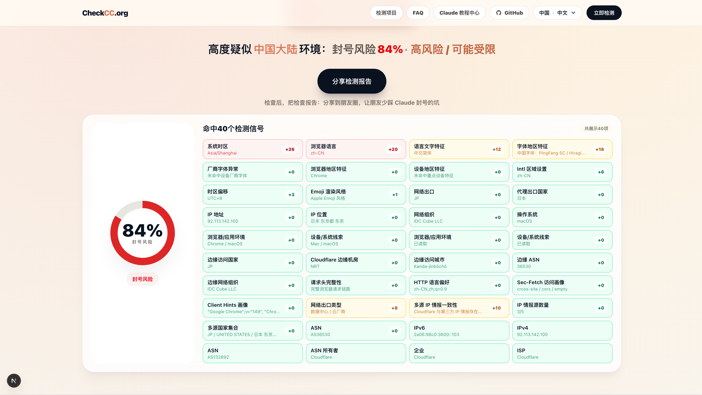
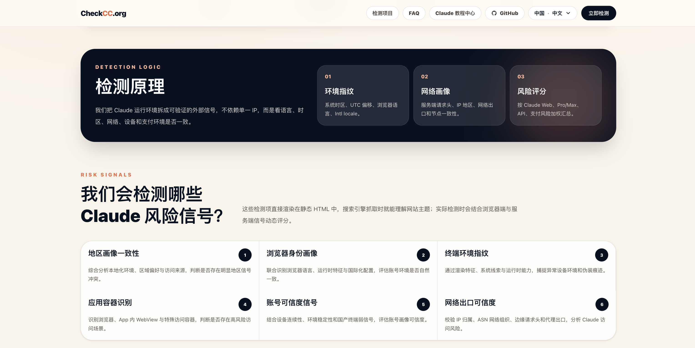
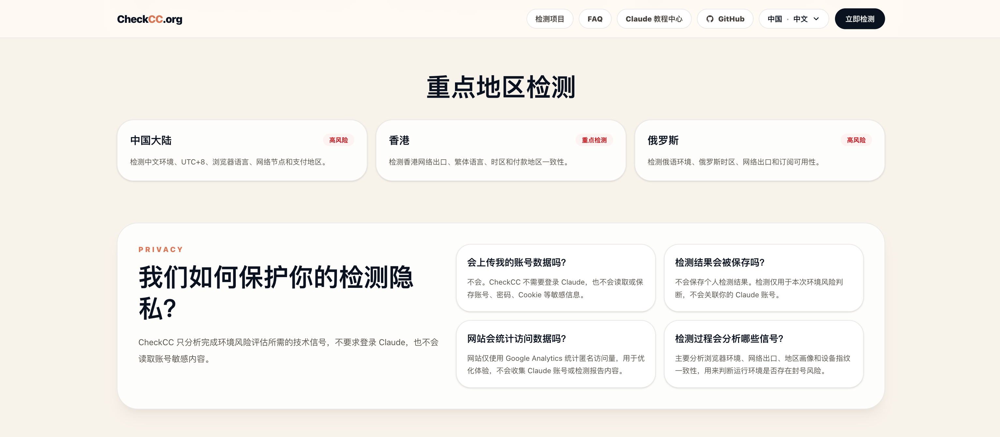

# CheckCC

[中文](README.md) | [English](README.en.md)

<p align="center">
  
</p>

[CheckCC.org](https://checkcc.org) 是一个 Claude 运行环境检测与账号风险分析工具，面向正在注册 Claude 账号、订阅 Claude Pro、申请 Claude API、使用 Claude Code，或担心 Claude 封号、账号受限、订阅失败的用户。

项目通过浏览器指纹、系统时区、语言偏好、Intl Locale、User-Agent、运行容器、设备环境、网络出口和地区画像等信号，分析当前环境是否存在冲突，帮助用户提前识别 Claude 高风险环境、封禁前异常信号、账号受限风险、Claude Pro 订阅风险、Claude API 申请风险和 Claude Code 使用环境风险。

- 官方在线体验：<https://checkcc.org>
- GitHub 项目主页：<https://github.com/yacuo/check-cc>

## 项目截图

### 检测指标示例

<p align="center">
  
</p>

| 检测原理 | 重点检测地区 |
| --- | --- |
|  |  |

## 项目说明

[CheckCC](https://checkcc.org) 适合用于学习、二次开发和自部署。项目专注于 Claude 使用前后的环境风险提示，不读取 Claude 账号内容，不替代 Claude 或 Anthropic 的官方判断。

**若你基于本项目进行二次开发、重新部署或发布衍生版本，请保留原始版权、开源许可声明与项目来源：<https://github.com/yacuo/check-cc.git>**

## 技术原理

Claude 账号风险并非由单一 IP 或地区因素决定，而是由浏览器指纹、系统时区、语言偏好、网络出口、运行容器、设备环境和支付环境等多维信号共同构成环境画像。[CheckCC](https://checkcc.org) 内置 40+ 项环境检测维度，通过客户端环境采样、服务端请求分析、IP 情报识别、运行时特征识别和信号一致性校验，将分散的技术指标聚合为可读的风险判断，辅助识别 Claude 封号风险、账号受限风险、Claude Pro 订阅风险、Claude API 申请风险和 Claude Code 使用环境风险。

核心检测维度包括：

- **浏览器语言**：判断浏览器首选语言是否和使用地区一致。
- **系统时区**：判断系统时区是否和地区画像匹配。
- **Intl Locale**：检查 JavaScript 国际化环境是否暴露异常语言或地区特征。
- **User-Agent**：识别浏览器、系统和客户端容器特征。
- **运行容器**：判断是否存在 WebView、自动化环境、异常客户端等特征。
- **信号一致性**：综合判断语言、时区、地区和浏览器环境是否互相矛盾。

这些信号不能证明账号一定安全或一定会被限制，但可以帮助用户提前发现明显的环境画像冲突。

## 如何降低封号风险

[CheckCC](https://checkcc.org) 检测结果仅供参考，不代表 Claude 或 Anthropic 官方结论。使用 Claude、Claude Code、Claude Pro 或申请 Claude API 前，可以先检查运行环境。

一般建议：

- 尽量保持 IP、系统时区、浏览器语言和账号地区一致。
- 避免频繁切换国家、代理节点、设备和浏览器环境。
- 避免在 WebView、自动化浏览器、异常客户端或不稳定容器中登录账号。
- 订阅 Claude Pro、申请 Claude API 或使用 Claude Code 前，先检查运行环境。
- 如果检测到高风险信号，先调整环境，再继续登录、订阅或申请相关服务。
- 尽量使用长期稳定的网络出口和一致的设备环境，减少账号画像剧烈变化。

## 技术栈

- Next.js
- React
- TypeScript
- Tailwind CSS
- pnpm

## 功能特性

- 40+ 环境信号检测与风险提示
- 浏览器端环境采样与运行时特征识别
- Claude Web、Pro、API、Claude Code 使用前环境检查
- 多语言页面结构与响应式 UI
- 适合学习、二次开发和自部署

## 隐私说明

项目默认只做浏览器本地环境检测：

- 不需要登录 Claude
- 不读取 Claude 账号
- 不读取密码
- 不读取 Cookie
- 不读取聊天内容
- 不默认上传检测结果

## 快速开始

```bash
pnpm install
pnpm dev
```

打开：<http://localhost:3000>

## 构建

```bash
pnpm build
pnpm start
```

## 自部署说明

你可以将本项目部署到 Vercel、Cloudflare Pages、Netlify 或自己的服务器，也可以根据需求扩展检测规则、页面样式和部署方式。

## 适用场景

- 学习浏览器环境检测
- 研究 Claude 运行环境风险提示
- 搭建自用环境检测页面
- 作为开源项目二次开发基础

## 免责声明

[CheckCC](https://checkcc.org) 的检测结果仅基于浏览器本地环境信号进行风险提示，不代表 Claude 或 Anthropic 官方判断。请勿将检测结果作为账号安全、订阅状态或申诉结果的唯一依据。

## 开源协议

本项目基于 MIT 协议开源，Copyright © yacuo / CheckCC。

你可以自由使用、修改与再分发本项目。

任何副本、二次开发版本、自部署站点或项目的实质性部分，都必须保留原始版权与许可声明，并注明来源：<https://github.com/yacuo/check-cc.git>

如果你重新部署本项目，请保留页脚署名或仓库链接，方便访问者找到原项目。
