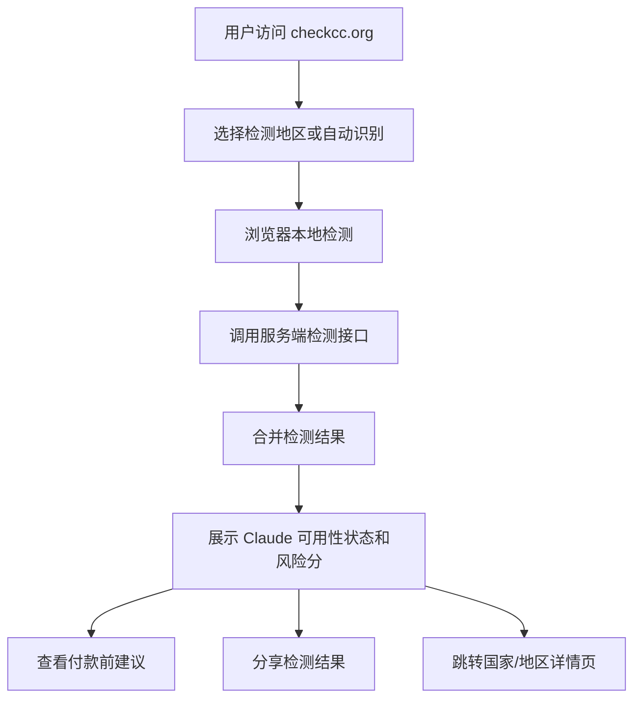

## 1. 产品概述

Check Claude 是面向 Claude 潜在用户的国家/地区可用性检测网站，域名为 checkcc.org，帮助用户在开通 Claude Pro / Max / API 前判断当前地区、网络和浏览器环境是否存在不支持或高风险问题。
- 解决用户“付费后才发现国家/地区不支持 Claude”的损失问题，核心目标是开通前检测、风险提示、降低误购。
- 第一版聚焦人口多、用户量大且 Claude 可用性存在限制或高风险的地区：中国大陆、俄罗斯、伊朗。

## 2. 核心功能

### 2.1 用户角色

| 角色 | 注册方式 | 核心权限 |
|------|----------|----------|
| 游客 | 无需注册 | 使用地区检测、查看结果、阅读国家说明、分享检测结果 |
| 登录用户（后续） | 邮箱 / OAuth 登录 | 保存检测历史、查看历史趋势、订阅提醒、管理账号设置 |
| 管理员（后续） | 后台分配 | 维护国家/地区支持状态、更新规则、查看统计数据 |

### 2.2 功能模块

1. **首页**：产品介绍、核心检测入口、三大重点地区入口、中国大陆/俄罗斯/伊朗说明摘要。
2. **检测页 / 检测组件**：地区选择、浏览器本地检测、服务端网络估算、风险分、产品可用性提示。
3. **国家/地区详情页**：中国大陆、俄罗斯、伊朗的 Claude Web / Pro / API / 支付风险说明。
4. **API 检测接口**：提供 `/api/check`，支持根据请求头、IP 地区、语言、UA 估算风险。
5. **多语言内容**：默认中文，英文使用 `/en` 路径；俄语后续按需求扩展。
6. **分享结果**：复制链接、Web Share、生成结果摘要图。
7. **后续用户体系预留**：登录、检测历史、用户仪表盘、订阅提醒、支付功能。

### 2.3 页面详情

| 页面名称 | 模块名称 | 功能描述 |
|----------|----------|----------|
| 首页 | Hero 区 | 展示 “Check Claude availability before paying”，突出避免冤枉钱 |
| 首页 | 快速检测 | 用户选择 China Mainland / Russia / Iran / Auto 后开始检测 |
| 首页 | 地区卡片 | 三个重点地区入口，展示支持状态、主要风险、语言入口 |
| 首页 | 信任说明 | 本地检测、不上传浏览器指纹、结果仅供参考 |
| 检测结果 | 综合状态 | 显示 Supported / Restricted / Unsupported / Unknown 与 0–100 风险分 |
| 检测结果 | 产品维度 | 分别展示 Claude Web、Claude Pro/Max、Claude API、支付风险 |
| 检测结果 | 信号列表 | 时区、语言、Intl locale、UA、字体、设备、服务端 IP 地区 |
| 检测结果 | 建议区 | 付款前建议、官方可用性核验提示、风险解释 |
| 国家页 | 中国大陆 | 简体中文为主，解释访问、订阅、API、支付与环境风险 |
| 国家页 | 俄罗斯 | 俄语为主，解释地区限制、支付、网络出口与语言/时区检测 |
| 国家页 | 伊朗 | 英文为主，后续可扩展波斯语，强调支付和地区限制 |
| API 文档 | 示例请求 | curl、JSON 格式、lang/region 参数说明 |
| 登录页（后续） | 认证表单 | 邮箱/OAuth 登录，第一版仅预留路由和架构 |
| Dashboard（后续） | 检测历史 | 保存和查看检测记录，第一版不实现 |

## 3. 核心流程

用户进入 checkcc.org 后，可以直接点击“开始检测”或选择目标地区。前端先执行浏览器本地检测，再请求服务端 `/api/check` 获取 IP/请求头估算，最终合并结果并生成风险报告。用户可以查看具体信号和付款前建议，也可以分享结果。

## 4. 用户界面设计

### 4.1 设计风格

- **整体风格**：可信、克制、国际化的工具站，不做夸张娱乐化；视觉感觉接近“金融风控 + 开发者工具”。
- **主色**：深墨蓝 `#0B1220`，用于页头、重要标题、深色区域。
- **强调色**：Claude 暖橙 `#D97757`，用于 CTA、风险强调、分数环。
- **辅助色**：绿色表示低风险，黄色表示需确认，红色表示高风险。
- **字体**：英文使用现代无衬线，中文/俄语使用系统优先字体保证跨平台清晰；后续可引入更有识别度的标题字体。
- **布局**：桌面优先，大屏左右分栏；平板两列；手机单列卡片。
- **组件风格**：shadcn/ui 卡片、按钮、Badge、Tabs、Accordion、Dialog。
- **动效**：检测过程使用逐项扫描、分数递增、信号卡片淡入；动效克制，突出专业可信。

### 4.2 页面设计概览

| 页面名称 | 模块名称 | UI 元素 |
|----------|----------|---------|
| 首页 | Hero 区 | 大标题、简短副标题、主 CTA、域名品牌、风险状态微组件 |
| 首页 | 检测器 | 地区选择 Tabs、开始按钮、扫描进度、结果卡片 |
| 首页 | 地区卡片 | China Mainland / Russia / Iran 三张高对比信息卡 |
| 首页 | FAQ | Accordion 展示常见问题 |
| 检测结果 | 分数仪表盘 | 圆环分数、状态 Badge、产品维度状态矩阵 |
| 国家详情 | 风险说明 | 信息卡、步骤建议、官方确认提醒 |
| API 文档 | 代码块 | curl 示例、JSON 结构、参数表 |

### 4.3 响应式

- **桌面端**：最大宽度 1200–1280px，Hero 和检测器左右分栏，地区卡三列。
- **平板端**：检测器和结果区两列或上下分区，按钮保持触控友好。
- **手机端**：单列布局，检测按钮全宽，结果卡片纵向堆叠，分享使用 Web Share API 优先。
- **触控优化**：按钮高度不低于 44px，卡片间距充足，避免横向滚动。
- **性能目标**：首屏轻量，检测逻辑仅在客户端需要时执行，非核心功能延迟加载。
