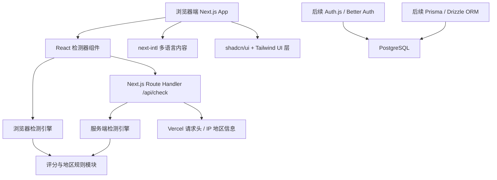
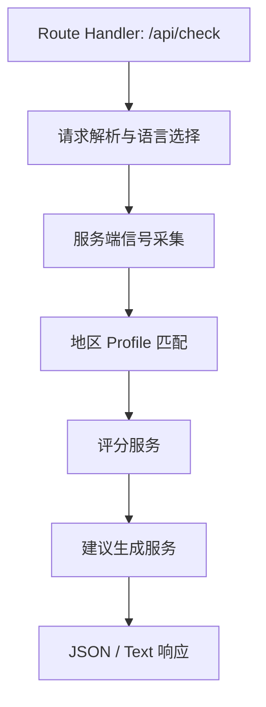
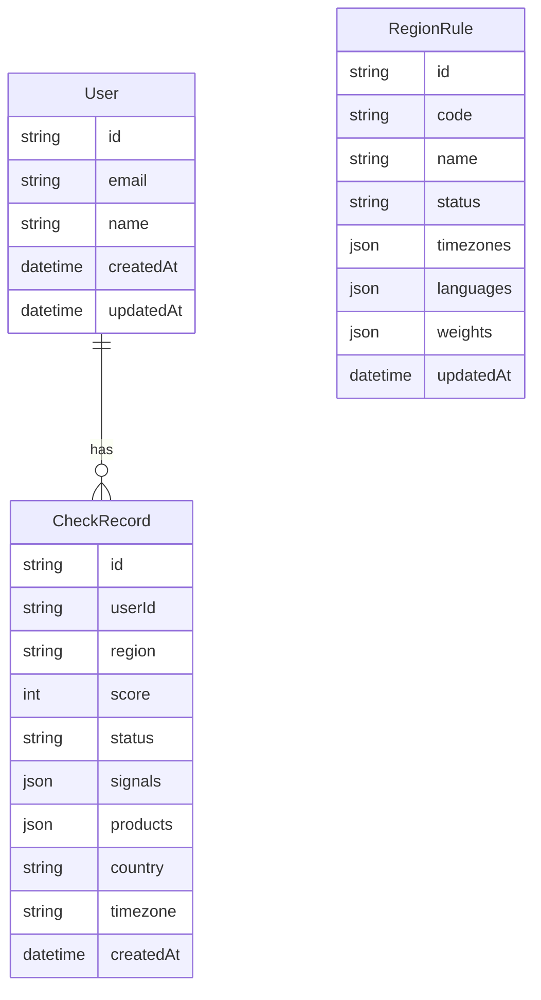

## 1. 架构设计



整体采用 Next.js App Router 全栈架构。第一版以游客检测为主，不强制接入数据库和登录；代码结构预留认证、数据库、检测历史和 Dashboard 扩展点。

## 2. 技术描述

- **语言**：TypeScript
- **框架**：Next.js 15+，App Router
- **UI**：React 19 + shadcn/ui
- **样式**：Tailwind CSS
- **多语言**：next-intl
- **包管理**：pnpm
- **部署**：Vercel
- **认证预留**：Better Auth 或 Auth.js，推荐后续优先评估 Better Auth
- **数据库预留**：PostgreSQL，推荐 Supabase / Neon
- **ORM 预留**：Prisma 或 Drizzle；开发速度优先用 Prisma，边缘兼容优先用 Drizzle
- **API**：Next.js Route Handlers
- **检测核心**：独立 TypeScript 模块，可同时供客户端组件和服务端 API 复用
- **域名**：checkcc.org

第一版建议安装的核心依赖：

```txt
next
react
react-dom
typescript
tailwindcss
next-intl
class-variance-authority
clsx
tailwind-merge
lucide-react
```

后续功能依赖：

```txt
better-auth 或 next-auth
prisma 或 drizzle-orm
@prisma/client 或 postgres
zod
```

## 3. 路由定义

| 路由 | 用途 |
|------|------|
| `/` | 默认中文首页 |
| `/en` | 英文首页 |
| `/china` | 中国大陆 Claude 可用性说明中文页 |
| `/russia` | 俄罗斯 Claude 可用性说明中文页 |
| `/iran` | 伊朗 Claude 可用性说明中文页 |
| `/en/china` | 中国大陆 Claude 可用性说明英文页 |
| `/en/russia` | 俄罗斯 Claude 可用性说明英文页 |
| `/en/iran` | 伊朗 Claude 可用性说明英文页 |
| `/api/check` | 服务端检测接口 |
| `/api/share-image`（可选） | 后续服务端生成分享图 |
| `/login`（后续） | 登录页 |
| `/dashboard`（后续） | 用户检测历史和账号中心 |

推荐 App Router 目录结构：

```txt
app/
  page.tsx
  china/page.tsx
  russia/page.tsx
  iran/page.tsx
  en/
    page.tsx
    china/page.tsx
    russia/page.tsx
    iran/page.tsx
  api/
    check/route.ts
  globals.css
  layout.tsx
components/
  detector/
  layout/
  ui/
lib/
  detection/
  regions/
  i18n/
  seo/
messages/
  zh-CN.json
  en.json
```

## 4. API 定义

### 4.1 GET `/api/check`

请求参数：

| 参数 | 类型 | 必填 | 说明 |
|------|------|------|------|
| `region` | `cn \| ru \| ir \| auto` | 否 | 目标检测地区，默认 auto |
| `lang` | `en \| zh-CN \| ru` | 否 | 返回语言 |
| `format` | `json \| text` | 否 | 返回格式，默认 json |

服务端读取：

- `accept-language`
- `user-agent`
- `x-vercel-ip-country`
- `x-vercel-ip-country-region`
- `x-vercel-ip-city`
- `x-vercel-ip-timezone`
- `x-forwarded-for`（不直接暴露，仅用于估算来源）

响应类型：

```ts
type AccessStatus = 'supported' | 'possibly_supported' | 'restricted' | 'unsupported' | 'unknown';

type ProductAccess = {
  web: AccessStatus;
  pro: AccessStatus;
  api: AccessStatus;
  payment: AccessStatus;
};

type SignalResult = {
  id: string;
  label: string;
  value: string | null;
  score: number;
  weight: number;
  contribution: number;
  source: 'browser' | 'server' | 'combined';
};

type CheckResponse = {
  app: 'Check Claude';
  domain: 'checkcc.org';
  region: 'cn' | 'ru' | 'ir' | 'auto';
  detectedCountry: string | null;
  detectedTimezone: string | null;
  score: number;
  status: AccessStatus;
  products: ProductAccess;
  signals: SignalResult[];
  recommendations: string[];
  disclaimer: string;
};
```

## 5. 服务端架构图



## 6. 数据模型

第一版不强制建库。为后续登录和历史记录预留模型。

### 6.1 数据模型定义



### 6.2 Prisma 预留模型

```prisma
model User {
  id        String        @id @default(cuid())
  email     String        @unique
  name      String?
  records   CheckRecord[]
  createdAt DateTime      @default(now())
  updatedAt DateTime      @updatedAt
}

model CheckRecord {
  id        String   @id @default(cuid())
  userId    String
  region    String
  score     Int
  status    String
  signals   Json
  products  Json
  country   String?
  timezone  String?
  createdAt DateTime @default(now())

  user User @relation(fields: [userId], references: [id], onDelete: Cascade)

  @@index([userId, createdAt])
  @@index([region])
}

model RegionRule {
  id        String   @id @default(cuid())
  code      String   @unique
  name      String
  status    String
  timezones Json
  languages Json
  weights   Json
  updatedAt DateTime @updatedAt
}
```

## 7. 检测模块设计

```txt
lib/detection/
  types.ts          # AccessStatus、SignalResult、RegionProfile 类型
  browser.ts        # 浏览器端检测：timezone、language、locale、UA、字体
  server.ts         # 服务端检测：IP country、timezone、Accept-Language、UA
  scoring.ts        # 权重计算、状态归类、建议生成
  merge.ts          # 合并浏览器和服务端结果
lib/regions/
  cn.ts             # 中国大陆规则
  ru.ts             # 俄罗斯规则
  ir.ts             # 伊朗规则
  index.ts          # profile 注册表
```

### 地区 Profile 示例

```ts
type RegionProfile = {
  code: 'cn' | 'ru' | 'ir';
  name: string;
  unsupportedLikelihood: 'high' | 'medium' | 'low';
  timezones: string[];
  languages: string[];
  countries: string[];
  browserPatterns: RegExp[];
  fontFamilies: string[];
  weights: Record<string, number>;
  products: ProductAccess;
};
```

## 8. 扩展规划

- **第一阶段**：游客检测、多语言首页、三地区说明、API 检测。
- **第二阶段**：登录、检测历史、用户 Dashboard。
- **第三阶段**：邮件提醒、地区状态更新通知、更多国家、官方支持状态维护后台。
- **第四阶段**：订阅服务、团队账号、API Key、第三方集成。
